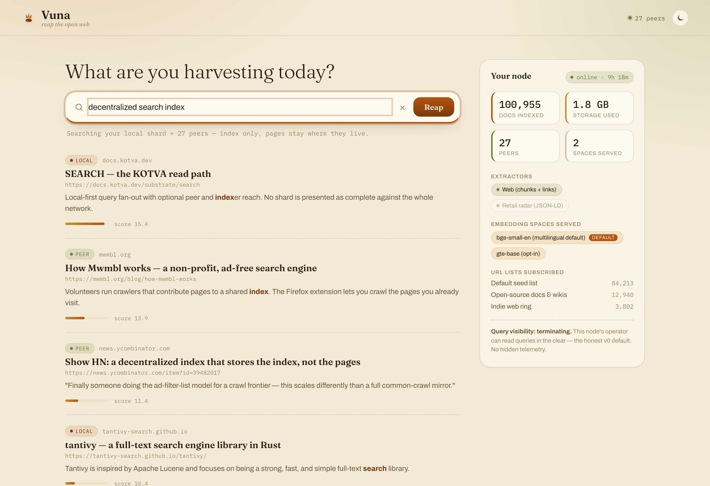
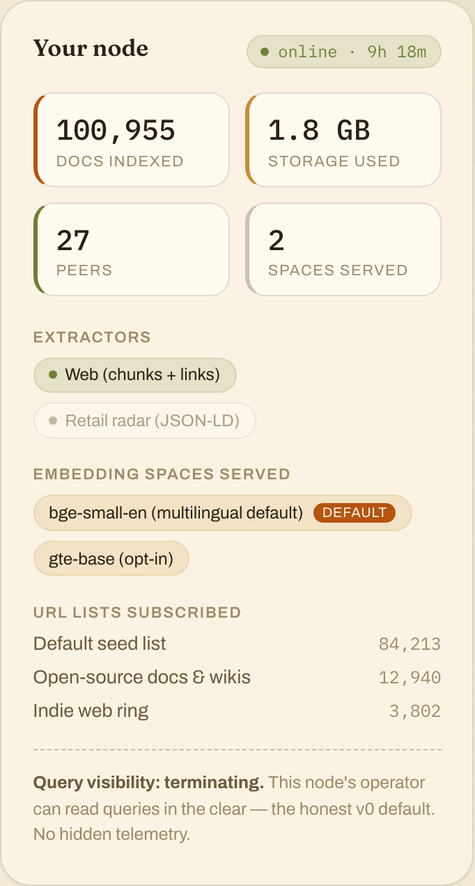

<div align="center">


# Vuna

### Keep the tally, not the field.

A decentralized **crawl → extract → index/graph** engine that stores the
**index, not the pages** — search/RAG and retail-radar as verticals of one engine,
on the [KOTVA](https://vulos.org) substrate. *Vuna* is Swahili for **to harvest / reap**.

[](LICENSE-MIT)
[](https://www.rust-lang.org)
[](https://tauri.app)
[](https://vulos.org)
[](#status)
[](#build--run)

[**Design**](docs/01-design.md) · [**Architecture**](docs/02-architecture.md) · [**Viability**](docs/00-viability.md) · [**Brand**](brand/README.md) · [**Product page**](https://vulos.org/products/vuna)

<br/>

<picture>
  <source media="(prefers-color-scheme: dark)" srcset="docs/shots/search-dark.png">
  
</picture>

<sub><em>The desktop app: local + peer results with source chips, and your node's dashboard. All data shown is <strong>mock</strong> — the query/node wiring is Wave 2 (see <a href="#status">status</a>).</em></sub>

</div>

---

## Status

**v0 preview — honest about what's real.** The substrate contract and four of the six
stage crates are implemented and tested (**132 tests green**, run in CI); the desktop app builds
and runs on **mock data**. It does not yet crawl-to-query end to end.

| Component | State |
|---|---|
| `vuna-core` — frozen contract (types, seam traits, retail **quorum** reconciler) | ✅ done (19 tests) |
| `vuna-crawl` — polite fetch (robots.txt, per-host rate-limit, body cap) | ✅ done (24 tests) |
| `vuna-extract` — `web` (chunks+links) + `retail` (JSON-LD/OG) extractors + the `adapters/*.toml` interpreter | ✅ done (67 tests) |
| `vuna-index` — tantivy BM25 + per-space HNSW vectors + link graph | ✅ done (9 tests) |
| `vuna-frontier` — distributed URL lists, dedup, DHT assignment | ✅ done (12 tests) |
| `vuna-query` — SEARCH read path (local-first + fan-out + Min-PPR) | 🚧 Wave 2 stub |
| `vuna-node` — daemon + `kotva-core` binding | 🚧 Wave 2 stub |
| `app/` — Tauri v2 desktop node (React) | ✅ builds, mock data |

**132 tests green** describes what compiles and behaves against its own fixtures — it is not
132 features shipped. There are zero live nodes, zero real users and zero bytes of real index
today. Every number in every screenshot in this README is a fixture from
[`app/src/lib/api.ts`](app/src/lib/api.ts) and
[`app/src-tauri/src/commands.rs`](app/src-tauri/src/commands.rs), and the app says so on
screen the whole time it is using them.

---

## What it is

A network of volunteer nodes crawls a **distributed, subscribable list of URLs**, runs
**pluggable extractors** over each page, and contributes the result — keyword postings,
vector embeddings, link/knowledge-graph edges, a snippet, and a **pointer back to the live
URL** — into a shared index replicated K× across the network. **Pages are never archived**,
which collapses storage from *petabytes (datacenters)* to *~2 GB/node (volunteers)* for a
billion-page index. No token, no page archive, no new crypto — it rides KOTVA identity /
PUB / DHT / SEARCH.

## Why it's different — everything is opt-in plurality

- **Embedding models** — each is an independent, parallel vector *space*. The keyword index
  and graph are model-agnostic and shared. New model → new space, adopted by **opt-in**,
  never a fleet-wide flag-day. Shards keep chunk *text*, so re-embedding is local recompute,
  not a re-crawl. *(This is what makes it future-proof instead of a lock-in trap.)*
- **Verticals** — each is an **extractor**. `web` emits chunks+links (search/RAG); `retail`
  emits price/stock observations (radar). Same crawl/frontier/distribution/query underneath.
- **Ranking is local-first** — the searcher runs their own node. Your shard answers first and
  offline-safe; peer and indexer reach is merged on top with Min-PPR over *your* link graph and
  *your* subscriptions. **No network-wide authority computes one number per document, so there
  is no ranking position anyone could sell** — and an opt-in indexer adds reach without ever
  becoming authoritative (KOTVA SEARCH `SRCH-2`). ⚠️ *The crate that does this,* `vuna-query`,
  *is a Wave-2 stub. The contract it will implement (`query::QueryEngine`, `Source`, `RankedHit`)
  is frozen and tested in* `vuna-core`*; the fan-out and the Min-PPR merge are not written yet.*
- A node serving the **default space + one URL list** is already a complete participant.

## Screenshots

<div align="center">
<picture>
  <source media="(prefers-color-scheme: dark)" srcset="docs/shots/dashboard-dark.png">
  
</picture>
<br/>
<sub><em>Your node, honestly surfaced: spaces served, lists subscribed, docs indexed, storage used, and a query-visibility disclosure (no hidden telemetry). All data is <strong>mock</strong> — the banner across the top of the app is part of the UI, not an annotation added for this README.</em></sub>
</div>

## How it works

```
distributed URL lists ─▶ crawl ─▶ extract ─▶ index (keyword + vectors/space + graph) ─▶ query
   (vuna-frontier)     (vuna-crawl)(vuna-extract)          (vuna-index)               (vuna-query)
        │                                                                                  │
        └───────────────────── KOTVA: identity · PUB · DHT · SEARCH ───────────────────────┘
                                      (vuna-node binds kotva-core)
```

The rightmost box, `vuna-query`, and the substrate binding, `vuna-node`, are stubs. Nothing in
that diagram runs end to end today.

The index is **derived, rebuildable, never authoritative** (KOTVA SEARCH SRCH-2): on any
disagreement, the author's signed content wins. For the retail vertical — where the store is
a *non-participant* that signs nothing — consensus of **K distinct, anchored observers** is
the only ground truth (`vuna-core::quorum`, one observer can't stuff the ballot).

## Architecture

The workspace compiles offline: `vuna-core` has minimal deps and defines the **frozen
contract** (types + seam traits); heavy deps (tantivy, HNSW, reqwest, embedding runtimes)
live only in the crate that needs them. `vuna-node` is the sole `kotva-core` dependent,
pinned by tag. Full write-up in [`docs/02-architecture.md`](docs/02-architecture.md).

## Storage — why volunteers suffice

Storing the index (not pages), ~6 KB/page: keyword ~2 KB · embeddings (int8) ~2.5 KB ·
graph ~0.3 KB · metadata ~0.7 KB.

| Corpus | 1 copy | ×3 redundant / 10k nodes |
|---|---|---|
| 1 B pages | ~6 TB | **~1.8 GB / node** |
| 10 B pages (Google-ish) | ~60 TB | ~18 GB / node |

These are budgets derived from the design, not measurements of a running network — there
isn't one. Compute (embedding), not storage, is the recurring cost — and it's embarrassingly
parallel. The honest trade-offs (compute vs. disk volunteers, Sybil at small scale, freshness)
are in [`docs/00-viability.md`](docs/00-viability.md) — read it before believing the pitch.

## Build & run

```bash
# engine (workspace)
cargo test --workspace        # 132 tests green
cargo build --workspace

# desktop app (mock data today)
cd app && npm install && npm run build
cargo tauri dev               # or: npm run tauri dev
```

Presentation-layer tooling — the landing-page check and the light/dark screenshots — lives in
`scripts/` and needs Playwright once:

```bash
npm install                   # repo root; playwright, a devDependency only
npx playwright install chromium
npm run site-check            # links, console errors, fonts actually applied, both themes
npm run screenshots           # regenerates docs/shots/ and site/shots/
```

Neither is required to build or test the engine — the Cargo workspace has no Node dependency.

## Brand

The mark, palette, type scheme and the measured contrast ratios are documented in
[`brand/README.md`](brand/README.md). `brand/tokens.css` is the single authority for colour
and type: the desktop app imports it and `site/index.html` mirrors it inline.

## Roadmap

- **Wave 2** — `vuna-query` (local-first fan-out + Min-PPR ranking) and `vuna-node`
  (crawl→extract→index→publish loop, `kotva-core` binding) to close the end-to-end path. Until
  `vuna-node` lands, nothing here is fed by a live crawl — including the adapters.
- **Wider adapter coverage** — the interpreter for `adapters/*.toml` ships (three worked
  manifests); the format still can't express secondary lookups, derived fetches, or multi-offer
  aggregation. See [`adapters/README.md`](adapters/README.md) for the exact boundary.
- **Roadmap app** — an opt-in browser extension contributing URLs-you-visit to the frontier
  (Mwmbl's proven model), off by default.
- **Not promised at v1** — v1 targets a *bounded* corpus (a federation's content or a curated
  vertical) where crawl is cheap and Sybil is dodged via KOTVA's vetted operators; the open web
  is a later research track. Compute-volunteer supply and small-network Sybil resistance both
  remain unsolved, and this design does not claim otherwise.

## License

[MIT](LICENSE-MIT) OR [Apache-2.0](LICENSE-APACHE) — © VulOS. Vuna is a VulOS
project; source and issues at [github.com/vul-os/vuna](https://github.com/vul-os/vuna).

Type in the app and on the site is Fraunces, Archivo and IBM Plex Mono, all SIL OFL 1.1 and
vendored — nothing is fetched from a third party at runtime.

---

<p align="center">
  <sub><a href="https://vulos.org"><b>vulos</b></a> — open by design</sub>
</p>
